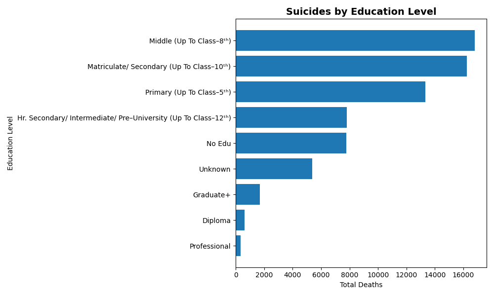
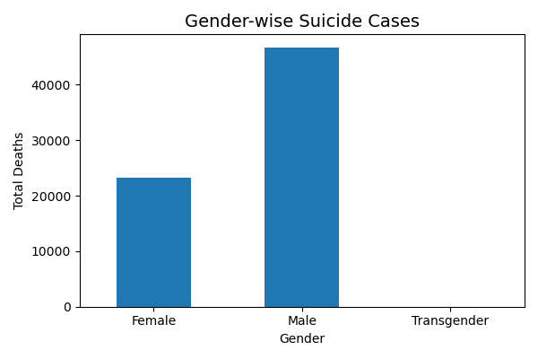

# 📊 Suicide Trends Analysis in India Based on Educational Status

## 📌 Project Overview
This project analyzes suicide trends in India based on educational status using Python. The analysis explores how educational attainment, gender, and yearly trends relate to suicide cases using Exploratory Data Analysis (EDA) and data visualization.

---

## 🎯 Objectives
- Analyze suicide cases based on educational status.
- Study yearly suicide trends.
- Compare suicide cases between males and females.
- Generate meaningful insights using data visualization.

---

## 🛠️ Tools & Technologies
- 🐍 Python
- 🐼 Pandas
- 📊 Matplotlib
- 📓 Jupyter Notebook

---

## 📂 Dataset
**Source:** India Data Portal (Government of India)

The dataset contains:
- Year
- State
- Gender
- Educational Status
- Number of Suicide Cases

---

## 📈 Key Insights
- Suicide cases are highest among lower and middle education groups.
- Male suicide cases are significantly higher than female cases.
- The highest number of reported cases was observed in **2018**.
- Suicide cases generally decrease as educational attainment increases.
- The overall trend fluctuates across the years.

---

## 📁 Repository Structure

```
## 📁 Repository Structure

```text
Suicide-Trends-Analysis-India
│
├── README.md
├── LICENSE
├── .gitignore
├── requirements.txt
├── Suicide_Trends_Analysis.ipynb
├── Suicide_Trends_Analysis_Presentation.pptx
└── images/
    ├── education_analysis.png
    ├── gender_analysis.png
    └── yearly_trend.png
```
## 📊 Project Visualizations

### Education-wise Analysis


### Gender-wise Analysis


### Year-wise Suicide Trend

---

## 🚀 Future Scope
- Perform state-wise and district-wise analysis.
- Build an interactive Power BI dashboard.
- Apply Machine Learning models to predict high-risk groups.
- Include socio-economic and occupational factors.

---

## 👩‍💻 Author

**Sayali Kamble**

🎓 BCA Graduate | Aspiring Data Analyst

### Skills
- Python
- SQL
- Power BI
- Excel
- Pandas
- Matplotlib

🔗 **LinkedIn:** https://www.linkedin.com/in/YOUR-LINKEDIN-URL

💻 **GitHub:** https://github.com/sayalikamble746-sys

---

⭐ If you found this project useful, consider giving it a star!
